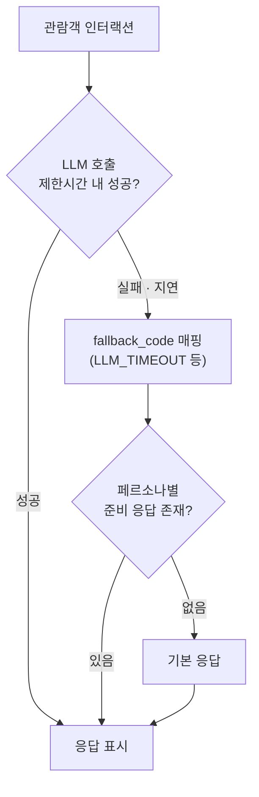
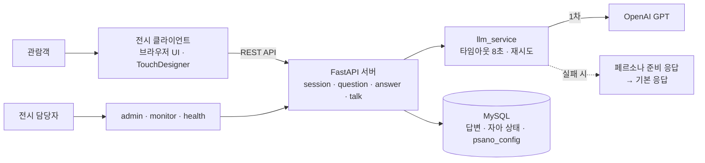

## Psano - 관람객의 선택으로 완성되는 AI 자아

<!-- ✍️ TODO: 전시 현장 사진 배너 -->


---
> [!IMPORTANT]
> 서울대학교 중앙도서관 **'융합 미디어작품 전시'**(2026.03.09 ~ 03.30) 출품작.
> 관람객의 답변이 쌓여 하나의 **AI 자아 '사노'** 가 만들어지는 인터랙티브 작품의
> **백엔드와 인터페이스를 단독으로 설계 · 구현 · 운영**했으며,
> 전시 기간 **22일(2026.03.09 ~ 03.30) 무중단 운영** 진행

---

### Tech Stack

| 분류 | 기술 |
| --- | --- |
| **Language / Framework** | Python 3.11, FastAPI, Uvicorn |
| **Database** | MySQL, SQLAlchemy 2.0 |
| **LLM** | OpenAI API (GPT-4o) |

---

### 작품 구조 (How Psano works)

- **형성기** — 관람객이 남긴 답변(총 365문항)이 10가지 가치 성향(5개 대립축)에 누적되어 사노의 성격이 만들어집니다.
- **대화기** — 365개의 답변이 모두 모이면 대화가 해금되어, 관람객이 완성된 사노와 자유롭게 대화할 수 있습니다.
- 대화 입력 200자 · 응답 150자 · 세션 메모리 600자 제한 등 전시 환경에 맞춘 대화 정책을 적용했습니다.

---

### 🛡️ 핵심 설계 - 3단계 폴백 & 무중단 운영

- **문제** — 전시장에 상주할 수 없는 상황에서, LLM 응답이 한 번이라도 멈추면 관람객 앞에서 작품 전체가 멈춥니다.
- **원칙** — "완벽한 응답"보다 **"끊기지 않는 경험"** 이 먼저입니다.



- **1차** — LLM 실시간 응답. 타임아웃 기본 **8초**, 재시도 포함
- **2차** — 실패 원인을 `fallback_code`(LLM_TIMEOUT 등)로 매핑해 **페르소나별 준비 응답**으로 전환
- **3차** — 그마저 어려우면 **기본 응답**으로 자연스럽게 마무리
- **운영 파라미터를 DB(`psano_config`)에서 로드** — 타임아웃 · 모델명 · 대화 턴 제한을 재배포 없이 어드민에서 조정
- **서버 시작 시 DB에서 GLOBAL_STATE 복원** — 재시작해도 자아 형성 진행 상태가 유지되는 자가 복구 구조
- **DB 커넥션 풀 안정화** — `pool_pre_ping` · `pool_recycle(1시간)` · 연결/읽기 타임아웃 설정으로 장시간 무인 운영 중 stale connection 방지
- `health` · `monitor` 라우터로 상태 점검, 비개발자 전시 담당자용 **어드민 페이지** 제공

---

### 전시 운영 아키텍처 (요청 흐름)



- 관람객용 형성기 화면(`/exhibit_teach`)은 **FastAPI가 HTML로 서빙** — 별도 프론트 배포 없이 서버 하나로 전시 전체를 운영
- CORS를 열어 TouchDesigner 등 전시장 장비에서도 동일 API를 호출

---

### 주요 기능

- 관람객 세션 · 질문 · 답변 수집 API (`session`, `question`, `answer`)
- 가치축 기반 자아(페르소나) 상태 관리 (`persona`, `state`)
- 대화 · 독백 · 대기 상태 연출 (`talk`, `monologue`, `idle`, `talk_policy`)
- 전시 연동 인터페이스 (`exhibit`, `exhibit_talk`, `ui`)
- 운영 도구 — 어드민 · 헬스체크 · 모니터링 (`admin`, `health`, `monitor`)

---

### Package Structure

```
psano
├── main.py                 # FastAPI 엔트리포인트 (lifespan에서 상태 복원)
├── database.py             # DB 연결
├── logging_conf.py         # 로깅 설정
├── middleware/
│   └── access_log.py       # 요청 로그 미들웨어
├── models/                 # session · question · answer · psano_state
├── routers/                # 도메인별 API (session, talk, admin, monitor 등 17개)
├── schemas/                # Pydantic 요청/응답 스키마
├── services/
│   ├── llm_service.py      # LLM 호출 · 타임아웃 · 폴백 처리
│   └── session_service.py  # 세션 로직
└── util/                   # constants(운영 상수) · talk_utils · utils
```

---

### Exhibition

<p align="center">
  
  
  
  
</p>

---


> [!TIP]
> 전시: 서울대학교 중앙도서관 '융합 미디어작품 전시' (2026.03.09 ~ 03.30)

https://github.com/user-attachments/assets/5e5fecdc-c325-4a40-819b-81a99dda86dc


